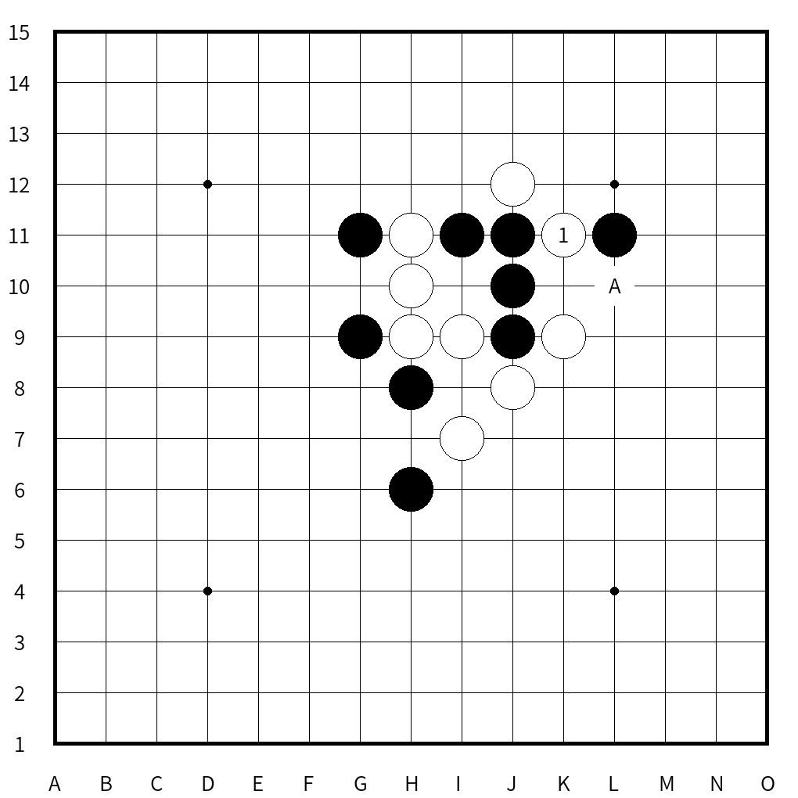
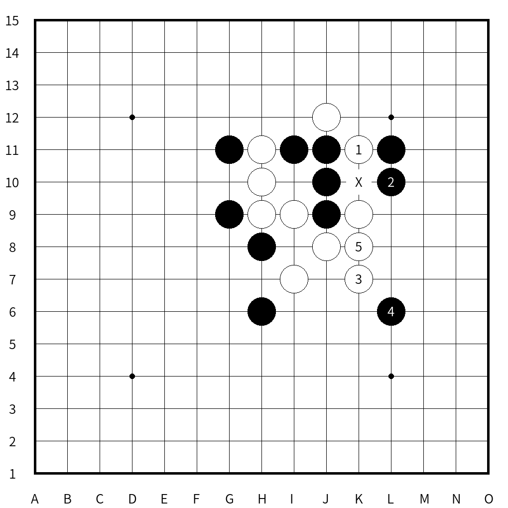

# 盤面生成プログラム for 連珠
連珠の盤面図を作成します。

特に五目クエストの棋譜を利用して、出題や解説資料を作る際に有用でしょう。

# 必要環境
Python3

# 使い方
`python3 renju.py <sgf input file>`

最後の`<sgf input file>`は適宜、自分のファイル名に置き換えてください。

## フォーマット
五目クエストの棋譜を元に、情報を付け加えます。

棋譜ファイルは例えば[ここ](http://c-loft.com/renju/quest/)から手に入ります。

サンプルとして`0001.sgf`ファイルをつけていますので、このファイルを基に説明します。

### ４行目まで
ダウンロード直後であれば、ここまで対局者の情報や棋譜情報が書かれています。

基本的に書き換えることは不要ですが、珠形提示情報を含む場合は例外です。

3手目までについて`;QPR[hh,gi,jf];QSLB[];`を`;B[hh];W[gi];B[jf];`など適切に書き換えてください。

今後のバージョンで追加処理を行います。

### 5行目
問題図として利用する手数を半角整数値で入力します。この数字までの手数が問題図として表示されます。

### 6行目
生成する解説資料について、その分岐の数を半角整数値で指定します。例えば3つの分岐であれば、`3`と打ち込みます。

### 7行目以降
問題図の次の手以降の順を入力します。

`1[D6]`など数字から始まる場合、指定した座標に数字付きの石を置きます。

`A[D6]`など英字から始まる場合、指定した座標に英字を描き、石は表示しません。

禁じ手の場所は大文字のエックス`X`を使ってください。

サンプル7行目の場合。K11に1を描き、L12に文字Aを描きます。

サンプル8行目の場合。上と同様に5まで描き、K10地点は黒三三禁の意味でXを描いています。なお禁じ手表示は自動対応しておりません。あくまで全て手動です。

# メリットとデメリット
## メリット
+ 棋譜ファイルを直接いじるだけで、使用に耐えうるクオリティの図を作成できます。
+ コマンドと併用で、大量のファイルを一気に出力する際には非常に向いています。

## デメリット
+ 禁じ手の自動判定やグラフィカルに盤の編集ができる点は他サイトの方が優れています。

# ライセンス
MITライセンスに従います。

ただし付属のフォントファイル(源ノ角ゴシック)はApache License 2.0に従います。

# 今後
珠形提示情報にも対応予定。

# バグなど
Issueを立てるか、[Twitter(@ch_suginami)](https://twitter.com/ch_suginami)までご連絡ください。